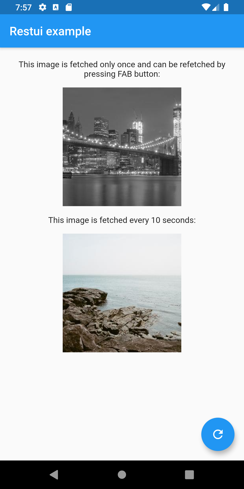

# Restui
[](https://pub.dev/packages/restui) 


#### A simple yet powerful wrapper around `http` library which provide:
  
| Feature                             |  Status  |
| :---------------------------------- | :------: |
| HTTP requests                       |    ✅    |
| HTTP interval requests              |    ✅    |
| HTTP requests from widget tree      |  ✅ 🧪   |
| HTTP Middlewares [ApiLink]          |  ✅ 🧪   |
| GraphQL client                      |  🧪 ⚙️    |
| Graphql request caching             |  🧪 ⚙️    |
| ApiLink for request caching         |    ❌    |

✅ - ready, minor API changes may occur  
🧪 - experimental, API   
⚙️  - work in progress  
❌ - not implemented  
  
---

## IMPORTANT
This library is under development, breaking API changes might still happen. If you would like to make use of this library please make sure to provide which version you want to use e.g:
```yaml
dependencies:
  restui: 0.4.0
```
  
---
  
- [Restui](#restui)
      - [A simple yet powerful wrapper around `http` library which provide:](#a-simple-yet-powerful-wrapper-around-http-library-which-provide)
  - [IMPORTANT](#important)
  - [0. Quick stark](#0-quick-stark)
  - [1. Getting Started](#1-getting-started)
      - [1.1. First create your Api class by extending `BaseApi` class](#11-first-create-your-api-class-by-extending-baseapi-class)
      - [1.2. Provide your Api instance down the widget tree](#12-provide-your-api-instance-down-the-widget-tree)
      - [1.3.1 Make use of `Query` widget to make the API call from widget tree](#131-make-use-of-query-widget-to-make-the-api-call-from-widget-tree)
      - [1.3.2 Call api in old-school way](#132-call-api-in-old-school-way)
  - [2. Query widget](#2-query-widget)
  - [3. ApiLink](#3-apilink)
    - [3.1. About ApiLink](#31-about-apilink)
    - [3.2. Built-in ApiLinks](#32-built-in-apilinks)
      - [3.2.1. HeadersMapperLink](#321-headersmapperlink)
    - [3.3. Create own ApiLink](#33-create-own-apilink)
      - [3.3.1. Create link](#331-create-link)
      - [3.3.2. Get data from the link](#332-get-data-from-the-link)
  - [4. Example app](#4-example-app)
    - [4.1 Api example](#41-api-example)
  - [5. TODO:](#5-todo)

## 0. Quick stark
```dart
// define your api class
class Api extends ApiBase {
  Api({
    @required Uri uri,
  }) : super(uri: uri);
  
  // Define your requests
  Future<ExamplePhotoModel> getRandomPhoto() async {
    final response = await call(
      endpoint: "/id/${Random().nextInt(50)}/info",
      method: HttpMethod.get,
    );
    return ExamplePhotoModel.fromJson(json.decode(response.body));
  }
}

void main() async {
  // instantiate your API class
  final api = Api(uri: Uri.parse("example.com"));

  /// make API request
  final photo = await api.getRandomPhoto();
}
```


## 1. Getting Started

#### 1.1. First create your Api class by extending `BaseApi` class
```dart
class Api extends ApiBase {

  Api({
    @required Uri uri,
    ApiLink link,
    Map<String, String> defaultHeaders,
  }) : super(
          uri: uri,
          defaultHeaders: defaultHeaders,
          link: link,
        );

  /// Implement api request methods 
  Future<ExamplePhotoModel> getRandomPhoto() async {

    /// Use [call] method to make api request
    final response = await call(
      endpoint: "/id/${Random().nextInt(50)}/info",
      method: HttpMethod.get,
    );
    return ExamplePhotoModel.fromJson(json.decode(response.body));
  }
}

```

#### 1.2. Provide your Api instance down the widget tree
```dart
class MyApp extends StatelessWidget {
  @override
  Widget build(BuildContext context) {

    return RestuiProvider<Api>(
        apiBuilder: (_) => Api(
          uri: Uri.parse("https://picsum.photos"),
          link: HeadersMapperLink(["uid", "client", "access-token"])
              .chain(DebugLink(printResponseBody: true)),
        ),
        child: MaterialApp(
          title: 'flutter_starter_app',
          onGenerateRoute: _generateRoute,
        ),
      );
  }
}
```
#### 1.3.1 Make use of `Query` widget to make the API call from widget tree
For more information look **[HERE](#2-query-widget)**
```dart
class _ApiExampleScreenState extends State<ApiExampleScreen> {
  @override
  Widget build(BuildContext context) {
    return Query<ExamplePhotoModel, Api, void>(
      callBuilder: (BuildContext context, Api api, void variable) =>
          api.getRandomPhoto(),
      builder: (BuildContext context, bool loading, ExamplePhotoModel value) {
        return Center(
          /// Implementation ...
        );
      },
    );
  }
}
```
#### 1.3.2 Call api in old-school way
```dart
class _ApiExampleScreenState extends State<ApiExampleScreen> {

  @override
  void didChangeDependencies() {
    final api = Query.of<Api>(context);
    api.getRandomPhoto().then((ExamplePhotoModel photo) {
      // Do sth with response
    })
    super.didChangeDependencies();
  }

  @override
  Widget build(BuildContext context) {
    /// ...
  }
}
```


## 2. Query widget
Query widget is the hearth of Restui library. It allows you to handle API
calls.
  
```dart
class _ApiExampleScreenState extends State<ApiExampleScreen> {
 
  @override
  Widget build(BuildContext context) {
    bool hasPhotot = _randomPhoto != null;

    /// `Query<R, A extends BaseApi, V>`
    /// [R] is type of value that will be returned from [callBuilder] and passed to [builder]
    /// as a [value] argument
    /// [A] is your api class implementation
    /// [V] is a variable type
    return Query<ExamplePhotoModel, Api, MyVariable>(
    
      /// Specifying [interval] will cause the query to be
      /// called periodically every [interval] of time.
      interval: const Duration(seconds: 10),

      /// Whether [callBuilder] will be called right before first
      /// [builder] invocation defaults to `true`.
      /// If `false` then [callBuilder] can be called by invocation of  [call] method from
      /// [QueryState] which can be retrieved by [GlobalKey] assigned to [key] argument
      instantCall: false,

      /// Variable of type [V]
      /// Will be passed to the [callBuilder] method
      variable _myVariable,

      /// Data returned from [initialDataBuilder] will be passed
      /// as [value] argument to [builder] method when [callBuilder]
      /// does not return the value yet.
      initialDataBuilder: (BuildContext context, Api api) => _initialData,
      
      /// This argument is REQUIRED
      /// [callBuilder] is the place when you can and should make api request.
      ///
      /// It is responsible for getting data and passing it into [builder] function
      /// as [value] argument.
      ///
      /// TIP:
      /// If data is inside your [ApiStorage] you can return it instead of making api call.
      callBuilder: (BuildContext context, Api api, MyVariable variable) async =>
          api.photos.getRandom(),

      /// [onComplete] is called only when [callBuilder] function returned succesfuly
      /// without throwing an [Exception]. Throwing an [Exception] from [callBuilder]
      /// will cause [onError] function invocation instead.
      ///
      /// [onComplete] callback is called after [callBuilder] with
      /// the data returned from it. Called just before [builder] invocation.
      onComplete: (BuildContext context, ExamplePhotoModel photo) {
         /// Implementation ...
      },

      /// If [callBuilder] function will throw an [Exception] it will be
      /// catched and passed to [onError] function if it's provided.
      onError: (Exception exception) {
        print(exception);
      }

      /// This works like an [Updater] widget, [AnimationBuilder], [StreamBuilder] etc.
      ///
      /// [updaterBuilder] is called right before first widget build. It must return [Listenable]
      /// object. Returning null will take no effect.
      ///
      /// [Query] widget will call [builder] every time when [Listenable] returned from
      /// [updaterBuilder] will notify his listeners.
      updaterBuilder: (BuildContext context, Api api) =>
          api.storage.getFirstLinkOfType<AuthNotifierLink>(),

      /// This method is called before every [builder] invocation triggered by [Listenable]
      /// returned from [updaterBuilder] or [callBuilder] method invocation.
      /// Returning [false] from this method will prevent calling [builder].
      /// Returning null will take no effect.
      shouldUpdate: (BuildContext context, Api api, ExamplePhotoModel value) => true, 

      /// This argument is REQUIRED
      /// [value] will be [null] or [initialData] (if argument provided) untill
      /// first value are returned from [callBuilder].
      /// [loading] indicates whether [callBuilder] method is ongoing.
      builder: (BuildContext context, bool loading, ExamplePhotoModel value) {
        return Center(
          /// Implementation ...
        );
      },
    );
  }
}
```

## 3. ApiLink

### 3.1. About ApiLink
`ApiLink` object is kind of a middleware that enables you to add some custom
behaviour before and after every API request.
  
Links can be then Retrieved from your API class [MORE](#22-get-data-from-the-link).

### 3.2. Built-in ApiLinks

#### 3.2.1. HeadersMapperLink
This [ApiLink] takes headers specified by [headersToMap] argument
from response headers and then put to the next request headers.
  
It can be used for authorization. For example,we have an `authorization`
header that changes after each request and with the next query we
must send it back in headers. This [ApiLink] will take it from the
response, save and set as a next request header.
  
Example use simple as:
```dart
final api = Api(
  uri: Uri.parse("https://picsum.photos"),
  link: HeadersMapperLink(["authorization"]),
);
```


### 3.3. Create own ApiLink
If you want to create your own ApiLink with custom behaviour all you need to do is to create your link class that extend `ApiLink` class and then pass it to your api super constructor (constructor of `ApiBase` class) (e.g. [[1](#1-first-create-your-api-object-class-by-extending-baseapi-class)] [[2](#2-provide-your-api-instance-down-the-widget-tree)]).

#### 3.3.1. Create link
```dart
class OngoingRequestsCounterLink extends ApiLink {
  int ongoingRequests;

  OngoingRequestsCounterLink() : _requests = 0;

  /// All you need to do is to override [next] method and add your
  /// custom behaviour
  @override
  Future<ApiResponse> next(ApiRequest request) async {
    
    /// Code here will be called `BEFORE` request
    ongoingRequests++;

    /// Calling [super.next] is required. It calls next [ApiLink]s in the 
    /// chain and returns with [ApiResponse]. 
    ApiResponse response = await super.next(request);

    /// Code here will be called `AFTER` request
    ongoingRequests--;

    /// [next] method should return [ApiResponse] as it passes it down the
    /// [ApiLink] chain
    return response;
  }
}
```

#### 3.3.2. Get data from the link 
Sometimes there is a need to retrieve data saved inside a link or pass some data into it. This is possible thanks to the:
```dart
/// Retrieve `Api` instance from the tree
Api api = Query.of<Api>(context);

/// Get first link of provided type
OngoingRequestsCounterLink link = api.getFirstLinkOfType<OngoingRequestsCounterLink>();

/// Do sth with your link data
print(link.ongoingRequests);
```
`Api` should be replaced with your API class name that extends `ApiBase`.

## 4. Example app
Inside `example` directory you can find an example app and play with this library.

### 4.1 Api example


  
## 5. TODO:
  - Tests
  - Improve readme
  - Add `CacheLink` which will be responsible for request caching